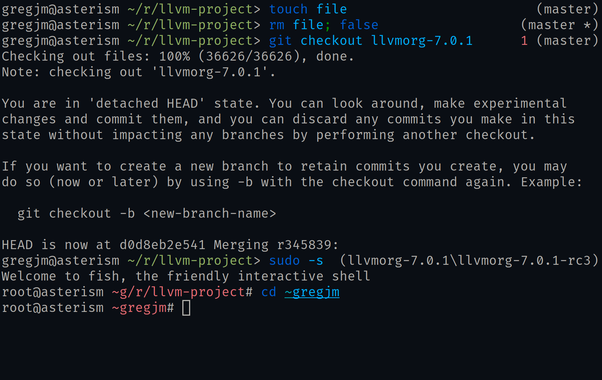

# clanker

[](https://crates.io/crates/clanker)

Clanker is a theme for fish with a focus on minimalism.



## Installation

```sh
cargo install clanker
```

Then place this in your `config.fish` or somewhere that will be sourced when
`fish` starts up:

```fish
function fish_prompt
    clanker-prompt
end

function fish_right_prompt
    clanker-right-prompt "$status"
end

function fish_title
    clanker-title "$_"
end
```

### Building From Source

```sh
git clone git@github.com:Gregory-Meyer/clanker.git
cd clanker
cargo build --release
```

You will then need to copy the binaries from `target/release` to somewhere in
your `PATH`, like `/usr/local/bin`.

## Usage

### `clanker-prompt`

`clanker-prompt` optionally takes up to two arguments and outputs the current
username, hostname, and compressed directory. Compression of the current
working directory is as expected - if in the current user's home directory, the
prefix is substituted with `~`. If in another user's home directory, the prefix
is substituted with `~USER`. If there is more than one component in the path,
all components but the last are trimmed to one or two extended grapheme
clusters. Components are trimmed to two extended grapheme clusters if 1. they
begin with a `.` or 2. they begin with a `~` and also are the first component
in the path - in other words, the result of prefix shortening to
`~USER/other/path/components`.

The two optional arguments are the unpriviliged cursor and priviliged cursor,
respectively. These default to `>` and `#` but you replace them at runtime
using these arguments.

### `clanker-right-prompt`

`clanker-right-prompt` optionally takes the status of the last command as an
argument. If the status was provided and was nonzero, it is printed in red. In
addition, if the current directory is a git repository according to the
behavior when running `git_repository_open_ext` with
`REPOSITORY_OPEN_FROM_ENV`, this will indicate either the current branch HEAD
points to, the current tag(s) that point to the same commit HEAD does, or the
short 7-digit SHA sum of the checked-out commit. If more than one tag points
to the same commit as HEAD, they will be delimited by a '\' (backslash).

### `clanker-title`

`clanker-title` optionally takes the currently running program as an argument
and prints it along with the compressed current working directory.
